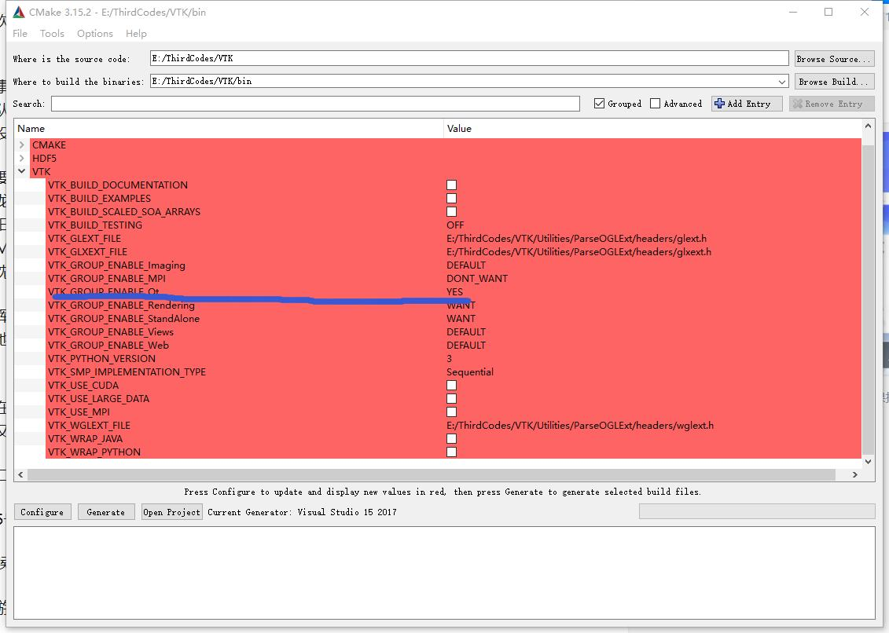
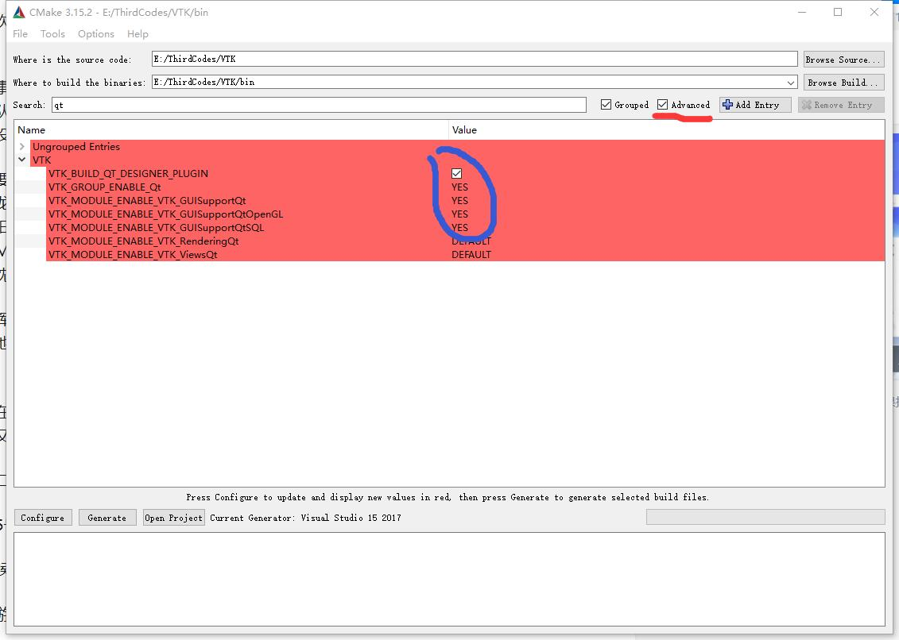
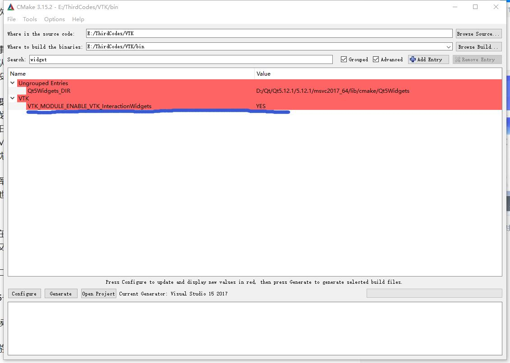
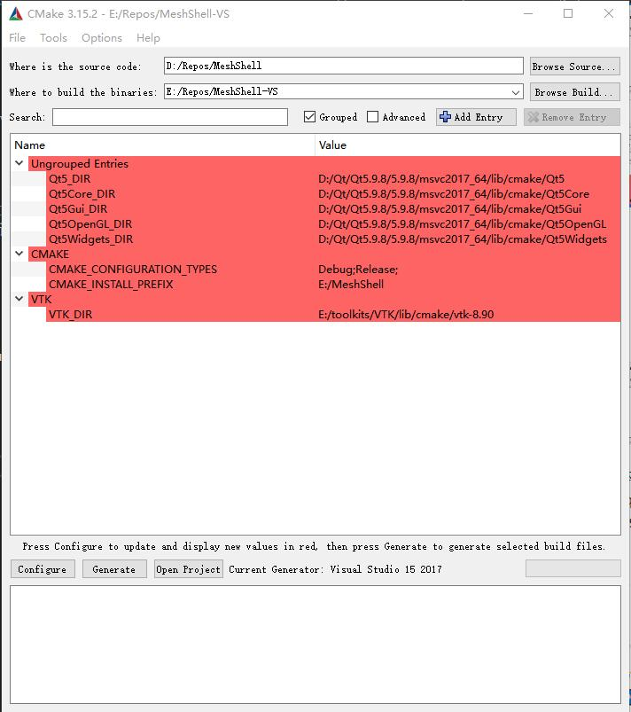

# Readme
## 源文件说明
### mesh_tools
该文件夹是一个独立的子项目.  
根目录中的mesh_wrapper.h作为外部项目引用的头文件,只提供函数接口.为了减少依赖项和便于包装为python包,除了Eigen外没有引用其他的库.具体的实现由MeshImpl和PrincipalStressField两个类来提供.  
mesh_wrapper.cxx中也可提供部分具体的实现,比如MeshImpl和PrincipalStressField的交互,等.
### OpenVolumeMesh
这个目录包含了OpenVolumeMesh的源代码,因此不需要再包含OVM库了.

### MeshShell
#### src
主要文件为mesh_shell.h/cxx,用于结合mesh_tools和渲染工具.  
view_manager_fwd.h中为抽象类ViewManager的声明,声明MeshShell需要的渲染接口.
#### view_tools
这个目录中的文件提供渲染的具体方法.  
VtkWrapper继承了ViewManager并使用VTK库实现其接口.  
#### widgets
这个目录中的源文件提供了图形化界面.

## 依赖库
1. 第三方库  
1.1 VTK  
版本号>=8.90  
1.2 boost  
1.3 Eigen3

2. 新建环境变量:  
为方便cmake找到包,windows下可以设置环境变量.

变量名|含义
-|-
EIGEN_DIR | Eigen3安装目录|
Qt5_DIR | Qt5的cmake文件的目录[^footnote]

[^footnote]: 比如在我的windows中是如下的目录D:\Qt\Qt5.9.8\5.9.8\msvc2017_64\lib\cmake\Qt5

### vtk
VTK是一个图形渲染库.  
[Github](https://github.com/Kitware/VTK.git)  
下载源代码,然后通过cmake编译安装.注意如下的选项要设置为YES  

将release和debug版本都编译安装.  
在安装目录/VTK/bin/qt5/plugins/designer目录中找到QVTKWidgetPlugin.dll,将其放到qt5根目录/5.9.8/msvc2017_64/plugins/designer中

## 安装
### windows
使用cmake生成visual studio工程  
Where is the source code: 源文件的根目录  
Where to build the binaries: VS工程生成目录

### Linux
直接使用cmake工程

